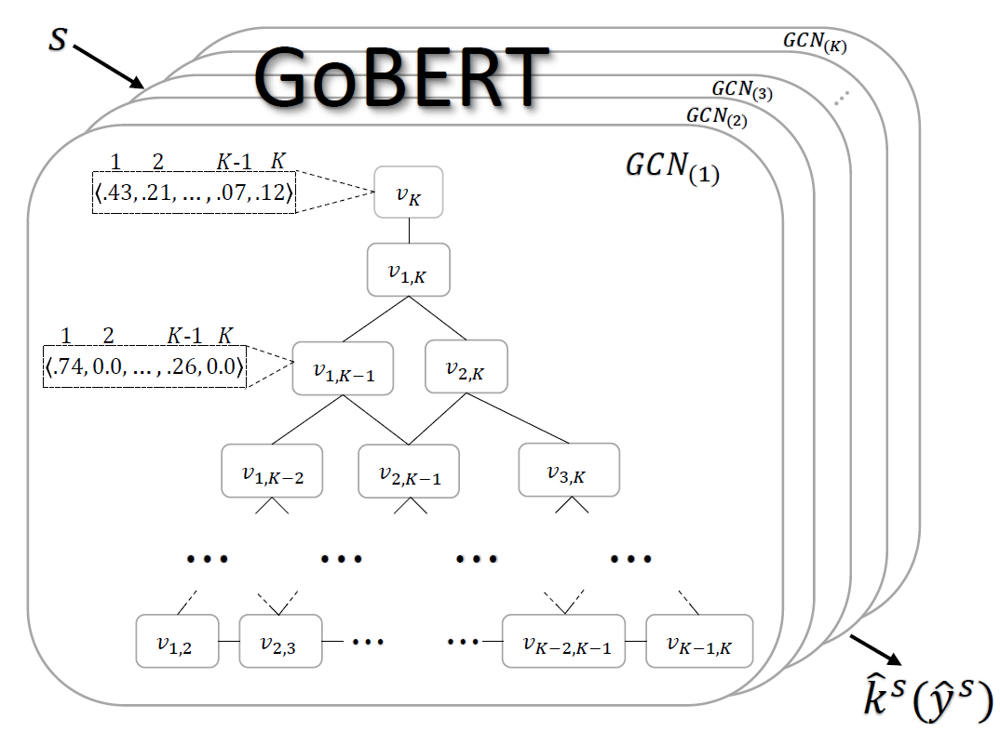

# GoBERT: Ordinal Text Classification using a Graph of Neural Networks

## Introduction

GoBERT is an architecture for ordinal text classification that uses a set of BERT-based models
to construct a graph neural network. Our paper is under review for [EMNLP'2021](https://2021.emnlp.org/).

## Prerequisites:  
1. GPU
2. [Anaconda 3](https://www.anaconda.com/download/)  
3. [Pytorch (Version 1.7)](https://pytorch.org/)
4. [Transformers (Version 4.2.1)](https://pytorch.org/hub/huggingface_pytorch-transformers/)
5. [Keras (Version 2.4.3)](https://keras.io/)
6. [PyTorch Geometric (Version 1.6.3)](https://pytorch-geometric.readthedocs.io/en/latest/#)
7. The same as described in [SentiLARE](https://github.com/thu-coai/SentiLARE) (only if you are interested in running SentiLARE).

## Getting Started

## Datasets

| Dataset  | # Train | # Validation | # Test | # Labels |
| ------------- | ------------- | ------------- | ------------- | ------------- |
| [SST-5](https://nlp.stanford.edu/sentiment/code.html)  | 8,544  | 1,101  |  2,210  | 5  | 
| [SemEval-2017 Task 4-A (English)](https://alt.qcri.org/semeval2017/task4/)  | 12,378  | 4,127  | 4,127  | 3  | 
| [Amazon (Amazon Fashion)](https://nijianmo.github.io/amazon/index.html)  | 9,136  | 3,045  | 3,046  | 5  | 

The used datasets are provided in the [data](./data/) folder, 
divided to train, validation and test.
We pre-process the original SemEval and Amazon dataset. 
The whole details are described in the notebook PreProcessDatasets.

Each file contains the following attributes:
* key_index: identifier.
* text
* overall: the correct class out of the possible labels.

## Fine-tuning of the Primary and Helper Models

1. Update the classes ConfigMain, ConfigPrimary and ConfigSubModel (Located in [Config](./config.py) file)
   with your configuration details.
2. Run [run_pipeline.sh](./run_pipeline.sh) to fine-tune the primary and 
   helper models. 
   To train the primary model solely, run [run_primary.sh](./run_primary.sh).
   To train the helper models solely, run [run_sub.sh](./run_sub.sh).

## Construct Graph of Neural Networks

1. Update the classes ConfigMain and ConfigGraphClassification (Located in [Config](./config.py) file)
   with your configuration details.
2. Run the file [test_inference.py](./test_inference.py) to train a graph of neural networks
   and perform inference.
